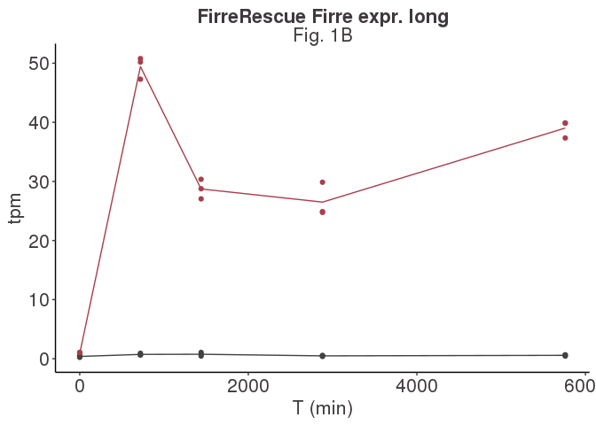
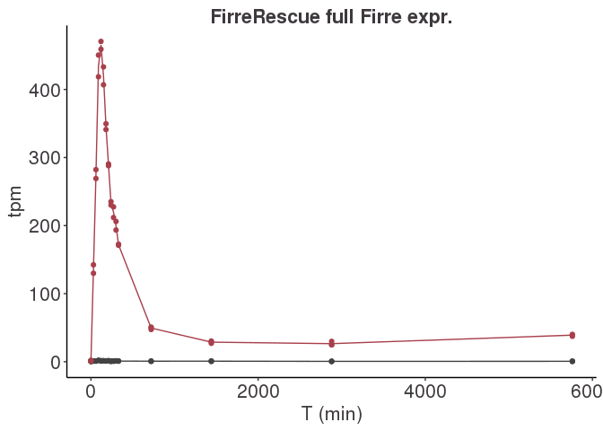
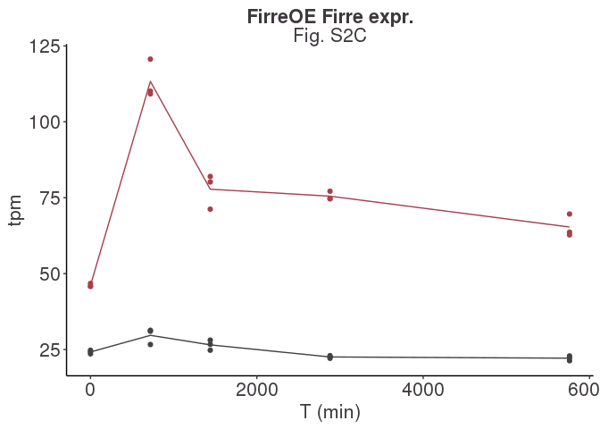
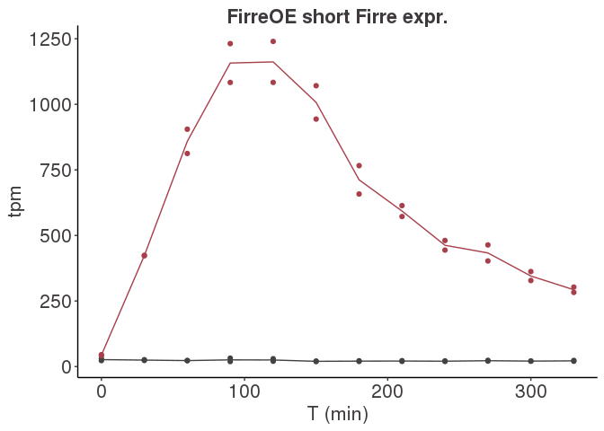
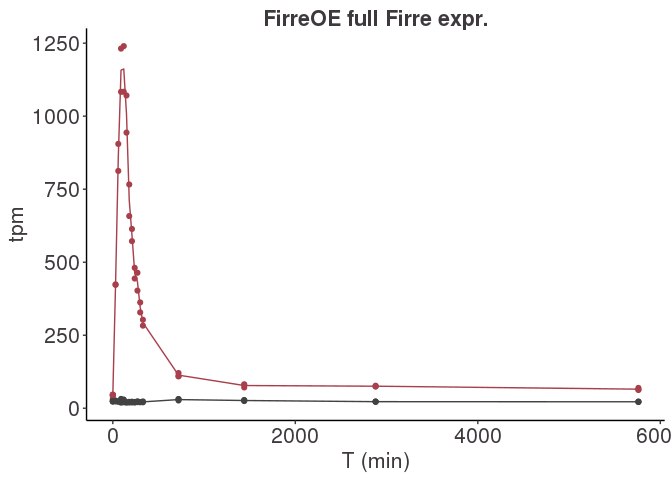

Firre’s expression profile
================

We would like to check that Firre’s expression is actually induced by
the addition of doxycycline.

## ESC KO (rescue)

### ESC KO long timecourse

``` r
firre_tpm <- tpm %>%
  filter(gene_name == "Firre") %>%
  pivot_longer(3:ncol(.), names_to = "sample_id", values_to = "tpm") %>%
  left_join(samples) %>%
  filter(cell_type == "ESC", firre_ko == "KO", timecourse_length == "long")

firre_means <- firre_tpm %>%
  group_by(timepoint, firre_induced) %>%
  summarize(tpm = mean(tpm)) %>%
  mutate(timepoint = as.numeric(as.character(timepoint)))
ggplot(firre_tpm, 
       aes(x = as.numeric(as.character(timepoint)), y = tpm, color = firre_induced)) +
  geom_line(data = firre_means, aes(x = timepoint, y = tpm, color = firre_induced,
                                    group = firre_induced)) +
  geom_point() + 
  theme(legend.position = "none") +
  xlab("T (min)")
```

<!-- -->

``` r
ggsave("figures/firre_esc_ko_profile_long.pdf", height = 3, width = 3, useDingbats = FALSE)
```

### ESC KO short timecourse

``` r
firre_tpm <- tpm %>%
  filter(gene_name == "Firre") %>%
  pivot_longer(3:ncol(.), names_to = "sample_id", values_to = "tpm") %>%
  left_join(samples) %>%
  filter(cell_type == "ESC", firre_ko == "KO", timecourse_length == "short")

firre_means <- firre_tpm %>%
  group_by(timepoint, firre_induced) %>%
  summarize(tpm = mean(tpm)) %>%
  mutate(timepoint = as.numeric(as.character(timepoint)))
ggplot(firre_tpm, 
       aes(x = as.numeric(as.character(timepoint)), y = tpm, color = firre_induced)) +
  geom_line(data = firre_means, aes(x = timepoint, y = tpm, color = firre_induced,
                                    group = firre_induced)) +
  geom_point() + 
  theme(legend.position = "none") +
  xlab("T (min)")
```

<!-- -->

``` r
ggsave("figures/firre_esc_ko_profile_short.pdf", height = 3, width = 3, useDingbats = FALSE)
```

### ESC KO Combined

``` r
firre_tpm <- tpm %>%
  filter(gene_name == "Firre") %>%
  pivot_longer(3:ncol(.), names_to = "sample_id", values_to = "tpm") %>%
  left_join(samples) %>%
  filter(cell_type == "ESC", firre_ko == "KO")

firre_means <- firre_tpm %>%
  group_by(timepoint, firre_induced) %>%
  summarize(tpm = mean(tpm)) %>%
  mutate(timepoint = as.numeric(as.character(timepoint)))
ggplot(firre_tpm, 
       aes(x = as.numeric(as.character(timepoint)), y = tpm, color = firre_induced)) +
  geom_line(data = firre_means, aes(x = timepoint, y = tpm, color = firre_induced,
                                    group = firre_induced)) +
  geom_point() + 
  theme(legend.position = "none") +
  xlab("T (min)")
```

<!-- -->

``` r
ggsave("figures/firre_esc_ko_profile.pdf", height = 3, width = 3, useDingbats = FALSE)
```

## ESC WT (overexpression)

### ESC WT long timecourse

``` r
firre_tpm <- tpm %>%
  filter(gene_name == "Firre") %>%
  pivot_longer(3:ncol(.), names_to = "sample_id", values_to = "tpm") %>%
  left_join(samples) %>%
  filter(cell_type == "ESC", firre_ko == "WT", timecourse_length == "long")

firre_means <- firre_tpm %>%
  group_by(timepoint, firre_induced) %>%
  summarize(tpm = mean(tpm)) %>%
  mutate(timepoint = as.numeric(as.character(timepoint)))
ggplot(firre_tpm, 
       aes(x = as.numeric(as.character(timepoint)), y = tpm, color = firre_induced)) +
  geom_line(data = firre_means, aes(x = timepoint, y = tpm, color = firre_induced,
                                    group = firre_induced)) +
  geom_point() + 
  theme(legend.position = "none") +
  xlab("T (min)")
```

<!-- -->

``` r
ggsave("figures/firre_esc_wt_profile_long.pdf", height = 3, width = 3, useDingbats = FALSE)
```

### ESC WT short timecourse

``` r
firre_tpm <- tpm %>%
  filter(gene_name == "Firre") %>%
  pivot_longer(3:ncol(.), names_to = "sample_id", values_to = "tpm") %>%
  left_join(samples) %>%
  filter(cell_type == "ESC", firre_ko == "WT", timecourse_length == "short")

firre_means <- firre_tpm %>%
  group_by(timepoint, firre_induced) %>%
  summarize(tpm = mean(tpm)) %>%
  mutate(timepoint = as.numeric(as.character(timepoint)))
ggplot(firre_tpm, 
       aes(x = as.numeric(as.character(timepoint)), y = tpm, color = firre_induced)) +
  geom_line(data = firre_means, aes(x = timepoint, y = tpm, color = firre_induced,
                                    group = firre_induced)) +
  geom_point() + 
  theme(legend.position = "none") +
  xlab("T (min)")
```

<!-- -->

``` r
ggsave("figures/firre_esc_wt_profile_short.pdf", height = 3, width = 3, useDingbats = FALSE)
```

### ESC WT Combined

``` r
firre_tpm <- tpm %>%
  filter(gene_name == "Firre") %>%
  pivot_longer(3:ncol(.), names_to = "sample_id", values_to = "tpm") %>%
  left_join(samples) %>%
  filter(cell_type == "ESC", firre_ko == "WT")

firre_means <- firre_tpm %>%
  group_by(timepoint, firre_induced) %>%
  summarize(tpm = mean(tpm)) %>%
  mutate(timepoint = as.numeric(as.character(timepoint)))
ggplot(firre_tpm, 
       aes(x = as.numeric(as.character(timepoint)), y = tpm, color = firre_induced)) +
  geom_line(data = firre_means, aes(x = timepoint, y = tpm, color = firre_induced,
                                    group = firre_induced)) +
  geom_point() + 
  theme(legend.position = "none") +
  xlab("T (min)")
```

<!-- -->

``` r
ggsave("figures/firre_esc_wt_profile.pdf", height = 3, width = 3, useDingbats = FALSE)
```

## NPC KO (rescue)

### NPC KO short timecourse

``` r
firre_tpm <- tpm %>%
  filter(gene_name == "Firre") %>%
  pivot_longer(3:ncol(.), names_to = "sample_id", values_to = "tpm") %>%
  left_join(samples) %>%
  filter(cell_type == "NPC", firre_ko == "KO", timecourse_length == "short")

firre_means <- firre_tpm %>%
  group_by(timepoint, firre_induced) %>%
  summarize(tpm = mean(tpm)) %>%
  mutate(timepoint = as.numeric(as.character(timepoint)))
ggplot(firre_tpm, 
       aes(x = as.numeric(as.character(timepoint)), y = tpm, color = firre_induced)) +
  geom_line(data = firre_means, aes(x = timepoint, y = tpm, color = firre_induced,
                                    group = firre_induced)) +
  geom_point() + 
  theme(legend.position = "none") +
  xlab("T (min)")
```

<!-- -->

``` r
ggsave("figures/firre_npc_ko_profile_short.pdf", height = 3, width = 3, useDingbats = FALSE)
```

## NPC WT (overexpression)

### NPC WT short timecourse

``` r
firre_tpm <- tpm %>%
  filter(gene_name == "Firre") %>%
  pivot_longer(3:ncol(.), names_to = "sample_id", values_to = "tpm") %>%
  left_join(samples) %>%
  filter(cell_type == "NPC", firre_ko == "WT", timecourse_length == "short")

firre_means <- firre_tpm %>%
  group_by(timepoint, firre_induced) %>%
  summarize(tpm = mean(tpm)) %>%
  mutate(timepoint = as.numeric(as.character(timepoint)))
ggplot(firre_tpm, 
       aes(x = as.numeric(as.character(timepoint)), y = tpm, color = firre_induced)) +
  geom_line(data = firre_means, aes(x = timepoint, y = tpm, color = firre_induced,
                                    group = firre_induced)) +
  geom_point() + 
  theme(legend.position = "none") +
  xlab("T (min)")
```

<!-- -->

``` r
ggsave("figures/firre_npc_wt_profile_short.pdf", height = 3, width = 3, useDingbats = FALSE)
```
