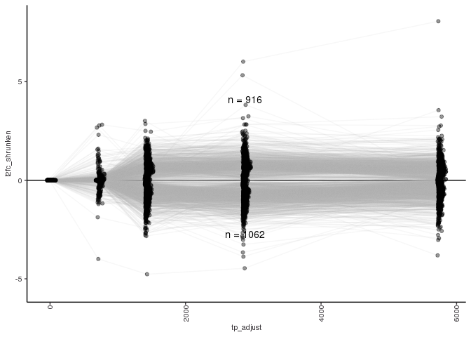
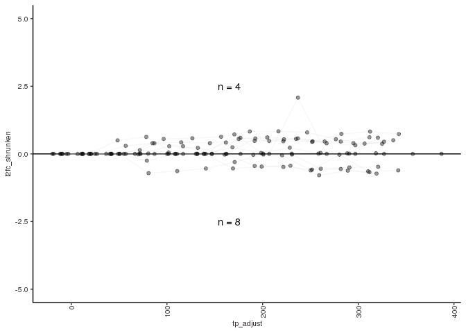
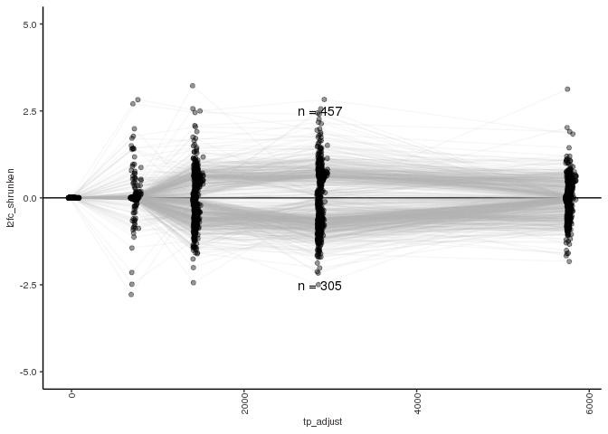
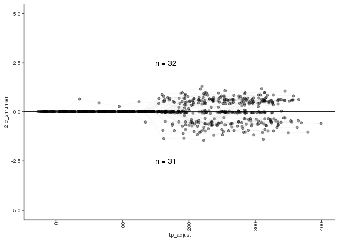
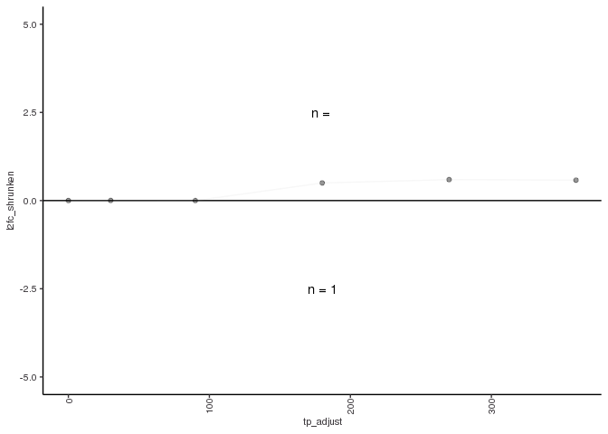

Doxycyline effect
================

### EC KO long timecourse dox effect

``` r
if(!file.exists("results/esc_ko_control_long.RData")) {
  source("../util/deseq.R")
  esc_ko_control_long <- deseq_vs_zero(ct = "ESC", 
                                       tc_len = "long", 
                                       fko = "KO", 
                                       fi = "control")
  save(esc_ko_control_long, file = "results/esc_ko_control_long.RData")
}

load("results/esc_ko_control_long.RData", verbose = T)
```

    ## Loading objects:
    ##   esc_ko_control_long

``` r
esc_ko_control_long <- esc_ko_control_long %>%
  mutate(sig = padj <= pval_thresh & max_abs_l2fc_shrunken > l2fc_thresh)

esc_ko_control_long_sig <- esc_ko_control_long %>% 
  filter(sig == TRUE)
```

``` r
make_timecourse_lfc_plot(deseq_res = esc_ko_control_long,
                         genes_to_include = unique(esc_ko_control_long_sig$gene_id),
                         y_lim = c(-5.5,8.2),
                         draw_plot = FALSE)
```

<!-- -->

``` r
ggsave(paste0("figures/esc_ko_control_long_lfc_", thresh, ".pdf"), 
       height = 3, width = 3.5, useDingbats = FALSE)
```

### ESC KO short timecourse dox effect

``` r
if(!file.exists("results/esc_ko_control_short.RData")) {
  source("../util/deseq.R")
  esc_ko_control_short <- deseq_vs_zero(ct = "ESC", 
                                       tc_len = "short", 
                                       fko = "KO", 
                                       fi = "control")
  save(esc_ko_control_short, file = "results/esc_ko_control_short.RData")
}

load("results/esc_ko_control_short.RData", verbose = T)
```

    ## Loading objects:
    ##   esc_ko_control_short

``` r
esc_ko_control_short <- esc_ko_control_short %>%
  mutate(sig = padj <= pval_thresh & max_abs_l2fc_shrunken > l2fc_thresh)

esc_ko_control_short_sig <- esc_ko_control_short %>% 
  filter(sig == TRUE)
```

``` r
make_timecourse_lfc_plot(deseq_res = esc_ko_control_short,
                         genes_to_include = unique(esc_ko_control_short_sig$gene_id),
                         draw_plot = FALSE)
```

<!-- -->

``` r
ggsave(paste0("figures/esc_ko_control_short_lfc_", thresh, ".pdf"), 
       height = 3, width = 3.5, useDingbats = FALSE)
```

### ESC WT long timecourse dox effect

``` r
if(!file.exists("results/esc_wt_control_long.RData")) {
  source("../util/deseq.R")
  esc_wt_control_long <- deseq_vs_zero(ct = "ESC", 
                                       tc_len = "long", 
                                       fko = "WT", 
                                       fi = "control")
  save(esc_wt_control_long, file = "results/esc_wt_control_long.RData")
}

load("results/esc_wt_control_long.RData", verbose = T)
```

    ## Loading objects:
    ##   esc_wt_control_long

``` r
esc_wt_control_long <- esc_wt_control_long %>%
  mutate(sig = padj <= pval_thresh & max_abs_l2fc_shrunken > l2fc_thresh)

esc_wt_control_long_sig <- esc_wt_control_long %>% 
  filter(sig == TRUE)
```

``` r
make_timecourse_lfc_plot(deseq_res = esc_wt_control_long,
                         genes_to_include = unique(esc_wt_control_long_sig$gene_id),
                         y_lim = c(-5,5),
                         draw_plot = FALSE)
```

<!-- -->

``` r
ggsave(paste0("figures/esc_wt_control_long_lfc_", thresh, ".pdf"), 
       height = 3, width = 3.5, useDingbats = FALSE)
```

### ESC WT Short timecourse dox effect

``` r
if(!file.exists("results/esc_wt_control_short.RData")) {
  source("../util/deseq.R")
  esc_wt_control_short <- deseq_vs_zero(ct = "ESC", 
                                       tc_len = "short", 
                                       fko = "WT", 
                                       fi = "control")
  save(esc_wt_control_short, file = "results/esc_wt_control_short.RData")
}

load("results/esc_wt_control_short.RData", verbose = T)
```

    ## Loading objects:
    ##   esc_wt_control_short

``` r
esc_wt_control_short <- esc_wt_control_short %>%
  mutate(sig = padj <= pval_thresh & max_abs_l2fc_shrunken > l2fc_thresh)

esc_wt_control_short_sig <- esc_wt_control_short %>% 
  filter(sig == TRUE)
```

``` r
make_timecourse_lfc_plot(deseq_res = esc_wt_control_short,
                         genes_to_include = unique(esc_wt_control_short_sig$gene_id),
                         draw_plot = FALSE)
```

<!-- -->

``` r
ggsave(paste0("figures/esc_wt_control_short_lfc_", thresh, ".pdf"), 
       height = 3, width = 3.5, useDingbats = FALSE)
```

### NPC KO Short timecourse dox effect

``` r
if(!file.exists("results/npc_ko_control_short.RData")) {
  source("../util/deseq.R")
  npc_ko_control_short <- deseq_vs_zero(ct = "NPC", 
                                       tc_len = "short", 
                                       fko = "KO", 
                                       fi = "control")
  save(npc_ko_control_short, file = "results/npc_ko_control_short.RData")
}

load("results/npc_ko_control_short.RData", verbose = T)
```

    ## Loading objects:
    ##   npc_ko_control_short

``` r
npc_ko_control_short <- npc_ko_control_short %>%
  mutate(sig = padj <= pval_thresh & max_abs_l2fc_shrunken > l2fc_thresh)

npc_ko_control_short_sig <- npc_ko_control_short %>% 
  filter(sig == TRUE)
```

There are no significant genes for NPC KO control.

### NPC WT Short timecourse dox effect

``` r
if(!file.exists("results/npc_wt_control_short.RData")) {
  source("../util/deseq.R")
  npc_wt_control_short <- deseq_vs_zero(ct = "NPC", 
                                       tc_len = "short", 
                                       fko = "WT", 
                                       fi = "control")
  save(npc_wt_control_short, file = "results/npc_wt_control_short.RData")
}

load("results/npc_wt_control_short.RData", verbose = T)
```

    ## Loading objects:
    ##   npc_wt_control_short

``` r
npc_wt_control_short <- npc_wt_control_short %>%
  mutate(sig = padj <= pval_thresh & max_abs_l2fc_shrunken > l2fc_thresh)

npc_wt_control_short_sig <- npc_wt_control_short %>% 
  filter(sig == TRUE)
```

``` r
make_timecourse_lfc_plot(deseq_res = npc_wt_control_short,
                         genes_to_include = unique(npc_wt_control_short_sig$gene_id),
                         draw_plot = FALSE)
```

<!-- -->

``` r
ggsave(paste0("figures/npc_wt_control_short_lfc_", thresh, ".pdf"), 
       height = 3, width = 3.5, useDingbats = FALSE)
```
