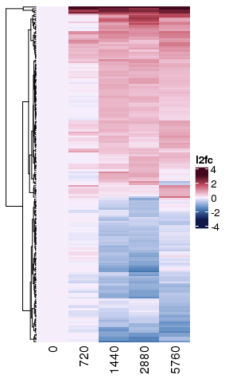

Long timecourse overexpression
================

For this experiment, we induced the expression of Firre with an rTTA
element by adding doxycycline to the cells. We see that Firre is indeed
expressed in the KO background after the addition of doxycycline. The
drug does instigate some gene expression changes on its own, so we will
control for the effects by using a linear model which accounts for the
effect of dox.

``` r
if(!file.exists("results/wt_overexp_long.RData")) {

  # Filter to ESC KO long timecourse
  wt_overexp_long_samples <- samples %>%
    filter(cell_type == "ESC",
           timecourse_length == "long",
           firre_ko == "WT")
  wt_overexp_long_counts <- salmon_gene_counts[,wt_overexp_long_samples$sample_id]
  
  # Check ordering
  stopifnot(all(rownames(wt_overexp_long_samples) == colnames(wt_overexp_long_counts)))
  stopifnot(all(rownames(wt_overexp_long_counts) == genes$gene_id))
  
  # DESeq2 -- controlling for doxycycline; likelihood ratio test
  wt_overexp_long_dds <- DESeqDataSetFromMatrix(countData = wt_overexp_long_counts, 
                                          colData = wt_overexp_long_samples, 
                                          design = ~ firre_induced + timepoint + timepoint*firre_induced)
  wt_overexp_long_dds <- DESeq(wt_overexp_long_dds, test = "LRT", reduced = ~ firre_induced + timepoint)
  
  # Compile results
  res_names <- resultsNames(wt_overexp_long_dds)
  dynamic_res <- res_names[grepl("firre_inducedfirre_induced.timepoint", res_names)]
  
  wt_overexp_long_lfc <- lapply(dynamic_res, function(x) {
    results(wt_overexp_long_dds, 
            name = x) %>%
      as.data.frame() %>%
      rownames_to_column("gene_id") %>% 
      merge(g2s) %>%
      mutate(result_name = x,
             timepoint = as.numeric(gsub("firre_inducedfirre_induced.timepoint", "", result_name)))
  }) %>% bind_rows()
  
  # Shrunken LFC results
  wt_overexp_long_shrnklfc <- lapply(dynamic_res, function(x) {
    lfcShrink(wt_overexp_long_dds, 
              coef = x,
              type = "apeglm") %>%
      as.data.frame() %>%
      rownames_to_column("gene_id") %>% 
      merge(g2s) %>%
      mutate(result_name = x,
             timepoint = as.numeric(gsub("firre_inducedfirre_induced.timepoint", "", result_name)))
  }) %>% bind_rows()
  
  # Calculate the maximum fold-change in any one timepoint
  wt_overexp_long_maxfc <- wt_overexp_long_shrnklfc %>%
    group_by(gene_id) %>%
    summarize(max_fc = max(abs(log2FoldChange))) 
  
  wt_overexp_long_shrnklfc <- wt_overexp_long_shrnklfc %>%
    left_join(wt_overexp_long_maxfc)
  
  save(wt_overexp_long_lfc, wt_overexp_long_shrnklfc, file = "results/wt_overexp_long.RData")
}

load("results/wt_overexp_long.RData", verbose = TRUE)
```

    ## Loading objects:
    ##   wt_overexp_long_lfc
    ##   wt_overexp_long_shrnklfc

### Fold changes vs zero timepoint

This is without considering the control cell line.

``` r
if(!file.exists("results/wt_overexp_long_vs_zero.RData")) {

  wt_overexp_long_vszero_samples <- samples %>%
    filter(cell_type == "ESC",
           timecourse_length == "long",
           firre_ko == "WT",
           firre_induced == "firre_induced")
  wt_overexp_long_vszero_counts <- salmon_gene_counts[,wt_overexp_long_vszero_samples$sample_id]
  
  # Check ordering
  stopifnot(all(rownames(wt_overexp_long_vszero_samples) == colnames(wt_overexp_long_vszero_counts)))
  stopifnot(all(rownames(wt_overexp_long_vszero_counts) == genes$gene_id))
  
  # DESeq2 -- controlling for doxycycline; likelihood ratio test
  wt_overexp_long_vszero_dds <- DESeqDataSetFromMatrix(countData = wt_overexp_long_vszero_counts,
                                                 colData = wt_overexp_long_vszero_samples,
                                                 design = ~ timepoint)
  wt_overexp_long_vszero_dds <- DESeq(wt_overexp_long_vszero_dds)
  res_names <- resultsNames(wt_overexp_long_vszero_dds)
  
  vs_zero_res <- res_names[grepl("_vs_0", res_names)]
  wt_overexp_long_vszero_shrnklfc <- lapply(vs_zero_res, function(x) {
    lfcShrink(wt_overexp_long_vszero_dds, 
              coef = x,
              type = "apeglm") %>%
      as.data.frame() %>%
      rownames_to_column("gene_id") %>% 
      merge(g2s) %>%
      mutate(result_name = x,
             timepoint = as.numeric(gsub("timepoint_|_vs_0", "", result_name)))
  }) %>% bind_rows()
  
  save(wt_overexp_long_vszero_shrnklfc, file = "results/wt_overexp_long_vs_zero.RData")
}

load("results/wt_overexp_long_vs_zero.RData", verbose = T)
```

    ## Loading objects:
    ##   wt_overexp_long_vszero_shrnklfc

### Long timecourse call significant genes

We’ll make the p-value cutoff based on the dox controlled model and the
l2fc cutoff based on the fold change vs zero.

``` r
wt_overexp_long_dox_sig <- wt_overexp_long_shrnklfc %>% 
  filter(padj <= pval_thresh)

wt_overexp_long_vszero_sig <- wt_overexp_long_vszero_shrnklfc %>%
  filter(gene_id %in% wt_overexp_long_dox_sig$gene_id)

wt_overexp_long_vszero_maxfc <- wt_overexp_long_vszero_sig %>%
  group_by(gene_id) %>%
  summarize(max_fc = max(abs(log2FoldChange))) 

wt_overexp_long_vszero_sig <- wt_overexp_long_vszero_sig %>%
  left_join(wt_overexp_long_vszero_maxfc)
```

    ## Joining, by = "gene_id"

``` r
wt_overexp_long_vszero_sig <- wt_overexp_long_vszero_sig %>%
  filter(max_fc > l2fc_thresh)

save(wt_overexp_long_vszero_sig, file = "results/wt_overexp_long_vszero_sig.RData")
```

### Long timecourse Firre responders heatmap

``` r
# Heatmap of fold-changes for DEGs in the rescue
# Check that there are no duplicate row names.
stopifnot(all(length(unique(wt_overexp_long_vszero_sig$gene_id)) == length(unique(wt_overexp_long_vszero_sig$gene_name))))

wt_overexp_long_lfc <- wt_overexp_long_vszero_sig %>%
  dplyr::select(gene_name, timepoint, log2FoldChange) %>%
  pivot_wider(names_from = timepoint, names_sort = TRUE, values_from = log2FoldChange) %>%
  column_to_rownames("gene_name") %>%
  as.matrix()

# Add a zero column.
wt_overexp_long_lfc <- cbind(matrix(0, nrow = nrow(wt_overexp_long_lfc), ncol = 1), wt_overexp_long_lfc)
colnames(wt_overexp_long_lfc)[[1]] <- "0"

pdf(paste0("figures/long_overexpression_responders_heatmap_", thresh, ".pdf"),
    width = 3, height = 5)
ht1 <- Heatmap(wt_overexp_long_lfc, 
        name = "l2fc",
        cluster_columns = FALSE, show_row_names = FALSE, 
        col = colorRamp2(seq(-3,3,length.out = 100), col_pal10))
draw(ht1)
dev.off()
```

    ## png 
    ##   2

``` r
draw(ht1)
```

<!-- -->
