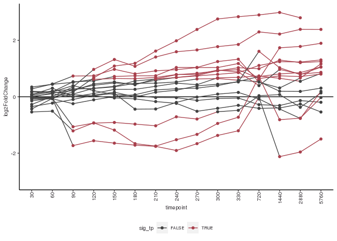
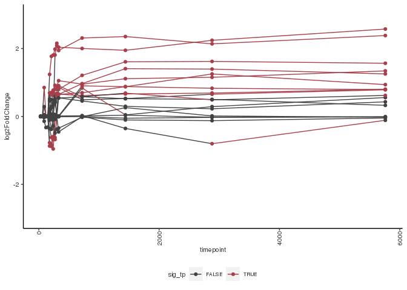

Combined Firre rescue
================

For this experiment, we induced the expression of Firre with an rTTA
element by adding doxycycline to the cells. We see that Firre is indeed
expressed in the KO background after the addition of doxycycline. The
drug does instigate some gene expression changes on its own, so we will
control for the effects by using a linear model which accounts for the
effect of dox.

``` r
if(!file.exists("results/ko_rescue_combined.RData")) {

  # Filter to ESC KO long timecourse
  ko_rescue_samples <- samples %>%
    filter(cell_type == "ESC",
           firre_ko == "KO")
  ko_rescue_counts <- salmon_gene_counts[,ko_rescue_samples$sample_id]
  
  # Check ordering
  stopifnot(all(rownames(ko_rescue_samples) == colnames(ko_rescue_counts)))
  stopifnot(all(rownames(ko_rescue_counts) == genes$gene_id))
  
  # DESeq2 -- controlling for doxycycline; likelihood ratio test
  ko_rescue_dds <- DESeqDataSetFromMatrix(countData = ko_rescue_counts, 
                                          colData = ko_rescue_samples, 
                                          design = ~ firre_induced + timepoint + timepoint*firre_induced)
  ko_rescue_dds <- DESeq(ko_rescue_dds, test = "LRT", reduced = ~ firre_induced + timepoint)
  
  # Compile results
  res_names <- resultsNames(ko_rescue_dds)
  dynamic_res <- res_names[grepl("firre_inducedfirre_induced.timepoint", res_names)]
  
  ko_rescue_lfc <- lapply(dynamic_res, function(x) {
    results(ko_rescue_dds, 
            name = x) %>%
      as.data.frame() %>%
      rownames_to_column("gene_id") %>% 
      merge(g2s) %>%
      mutate(result_name = x,
             timepoint = as.numeric(gsub("firre_inducedfirre_induced.timepoint", "", result_name)))
  }) %>% bind_rows()
  
  # Shrunken LFC results
  ko_rescue_shrnklfc <- lapply(dynamic_res, function(x) {
    lfcShrink(ko_rescue_dds, 
              coef = x,
              type = "apeglm") %>%
      as.data.frame() %>%
      rownames_to_column("gene_id") %>% 
      merge(g2s) %>%
      mutate(result_name = x,
             timepoint = as.numeric(gsub("firre_inducedfirre_induced.timepoint", "", result_name)))
  }) %>% bind_rows()
  
  # Calculate the maximum fold-change in any one timepoint
  ko_rescue_maxfc <- ko_rescue_shrnklfc %>%
    group_by(gene_id) %>%
    summarize(max_fc = max(abs(log2FoldChange))) 
  
  ko_rescue_shrnklfc <- ko_rescue_shrnklfc %>%
    left_join(ko_rescue_maxfc)
  
  save(ko_rescue_lfc, ko_rescue_shrnklfc, file = "results/ko_rescue_combined.RData")
}

load("results/ko_rescue_combined.RData", verbose = T)
```

    ## Loading objects:
    ##   ko_rescue_lfc
    ##   ko_rescue_shrnklfc

``` r
load("../05_long_timecourse_rescue/results/ko_rescue_long_vszero_sig.RData", verbose = TRUE)
```

    ## Loading objects:
    ##   ko_rescue_long_vszero_sig

``` r
load("../06_short_timecourse_rescue/results/ko_rescue_short_vszero_sig.RData", verbose = TRUE)
```

    ## Loading objects:
    ##   ko_rescue_short_vszero_sig

### Fold changes vs zero timepoint

This is without considering the control cell line.

``` r
if(!file.exists("results/ko_rescue_combined_vs_zero.RData")) {

  ko_rescue_vszero_samples <- samples %>%
    filter(cell_type == "ESC",
           firre_ko == "KO",
           firre_induced == "firre_induced")
  ko_rescue_vszero_counts <- salmon_gene_counts[,ko_rescue_vszero_samples$sample_id]
  
  # Check ordering
  stopifnot(all(rownames(ko_rescue_vszero_samples) == colnames(ko_rescue_vszero_counts)))
  stopifnot(all(rownames(ko_rescue_vszero_counts) == genes$gene_id))
  
  # DESeq2 -- controlling for doxycycline; likelihood ratio test
  ko_rescue_vszero_dds <- DESeqDataSetFromMatrix(countData = ko_rescue_vszero_counts,
                                                 colData = ko_rescue_vszero_samples,
                                                 design = ~ timepoint)
  ko_rescue_vszero_dds <- DESeq(ko_rescue_vszero_dds)
  res_names <- resultsNames(ko_rescue_vszero_dds)
  
  vs_zero_res <- res_names[grepl("_vs_0", res_names)]
  ko_rescue_vszero_shrnklfc <- lapply(vs_zero_res, function(x) {
    lfcShrink(ko_rescue_vszero_dds, 
              coef = x,
              type = "apeglm") %>%
      as.data.frame() %>%
      rownames_to_column("gene_id") %>% 
      merge(g2s) %>%
      mutate(result_name = x,
             timepoint = as.numeric(gsub("timepoint_|_vs_0", "", result_name)))
  }) %>% bind_rows()
  
  save(ko_rescue_vszero_shrnklfc, file = "results/ko_rescue_combined_vs_zero.RData")
}

load("results/ko_rescue_combined_vs_zero.RData", verbose = T)
```

    ## Loading objects:
    ##   ko_rescue_vszero_shrnklfc

### Call significant genes

``` r
table(ko_rescue_vszero_shrnklfc$timepoint)
```

    ## 
    ##    30    60    90   120   150   180   210   240   270   300   330   720  1440 
    ## 40914 40914 40914 40914 40914 40914 40914 40914 40914 40914 40914 40914 40914 
    ##  2880  5760 
    ## 40914 40914

``` r
table(ko_rescue_shrnklfc$timepoint)
```

    ## 
    ##    30    60    90   120   150   180   210   240   270   300   330   720  1440 
    ## 40914 40914 40914 40914 40914 40914 40914 40914 40914 40914 40914 40914 40914 
    ##  2880  5760 
    ## 40914 40914

``` r
ko_rescue_dox_sig <- ko_rescue_shrnklfc %>% 
  filter(padj <= pval_thresh)

ko_rescue_vszero_sig <- ko_rescue_vszero_shrnklfc %>%
  filter(gene_id %in% ko_rescue_dox_sig$gene_id)

ko_rescue_vszero_maxfc <- ko_rescue_vszero_sig %>%
  group_by(gene_id) %>%
  summarize(max_fc = max(abs(log2FoldChange))) 

ko_rescue_vszero_sig <- ko_rescue_vszero_sig %>%
  left_join(ko_rescue_vszero_maxfc)
```

    ## Joining, by = "gene_id"

``` r
ko_rescue_vszero_sig <- ko_rescue_vszero_sig %>%
  filter(max_fc > l2fc_thresh)

length(unique(ko_rescue_vszero_sig$gene_id))
```

    ## [1] 197

``` r
length(unique(ko_rescue_long_vszero_sig$gene_id))
```

    ## [1] 415

``` r
length(unique(ko_rescue_short_vszero_sig$gene_id))
```

    ## [1] 19

``` r
length(which(unique(ko_rescue_vszero_sig$gene_id) %in% unique(ko_rescue_long_vszero_sig$gene_id)))
```

    ## [1] 131

``` r
length(which(unique(ko_rescue_vszero_sig$gene_id) %in% unique(ko_rescue_short_vszero_sig$gene_id)))
```

    ## [1] 14

``` r
# Short timecourse sig genes.
stc_sig <- ko_rescue_vszero_shrnklfc %>%
  filter(gene_id %in% ko_rescue_short_vszero_sig$gene_id)
stc_sig <- stc_sig %>%
  mutate(timepoint = factor(timepoint, levels = c(seq(0,330,30), 720, 1440, 2880, 5760)))
stc_sig <- stc_sig %>%
  mutate(sig_tp = abs(log2FoldChange) > l2fc_thresh)
ggplot(stc_sig, aes(x = timepoint, y = log2FoldChange, group = gene_id, color = sig_tp)) +
  geom_hline(yintercept = 0) +
  geom_line() +
  geom_point() +
  ylim(-3,3)
```

    ## Warning: Removed 16 row(s) containing missing values (geom_path).

    ## Warning: Removed 16 rows containing missing values (geom_point).

<!-- -->

``` r
ggsave(paste0("figures/short_deg_full_timecourse_factor_", thresh, ".pdf"))
```

    ## Saving 7 x 5 in image

    ## Warning: Removed 16 row(s) containing missing values (geom_path).

    ## Warning: Removed 16 rows containing missing values (geom_point).

``` r
# What if we just append these
load("../05_long_timecourse_rescue/results/ko_rescue_long.RData", verbose = TRUE)
```

    ## Loading objects:
    ##   ko_rescue_long_lfc
    ##   ko_rescue_long_shrnklfc

``` r
load("../06_short_timecourse_rescue/results/ko_rescue_short.RData", verbose = TRUE)
```

    ## Loading objects:
    ##   ko_rescue_short_lfc
    ##   ko_rescue_short_shrnklfc

``` r
ko_rescue_combined <- bind_rows(ko_rescue_short_shrnklfc, ko_rescue_long_shrnklfc)

ko_rescue_combined_short_sig <- ko_rescue_combined %>%
  filter(gene_id %in% ko_rescue_short_vszero_sig$gene_id) %>%
  mutate(tp_factor = factor(timepoint, levels = c(seq(0,330,30), 720, 1440, 2880, 5760)),
         sig_tp = abs(log2FoldChange) > l2fc_thresh)

ggplot(ko_rescue_combined_short_sig, aes(x = timepoint, y = log2FoldChange, group = gene_id, color = sig_tp)) +
  geom_line() +
  geom_point() +
  ylim(-3,3)
```

    ## Warning: Removed 15 row(s) containing missing values (geom_path).

    ## Warning: Removed 15 rows containing missing values (geom_point).

<!-- -->

``` r
ggsave(paste0("figures/short_deg_full_timecourse_realtime_", thresh, ".pdf"))
```

    ## Saving 7 x 5 in image

    ## Warning: Removed 15 row(s) containing missing values (geom_path).

    ## Warning: Removed 15 rows containing missing values (geom_point).
